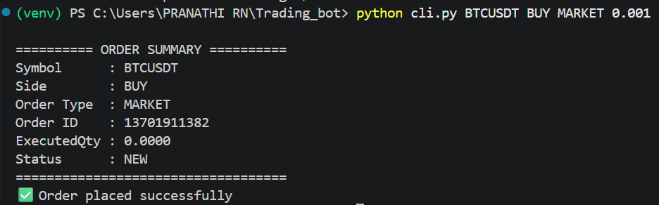
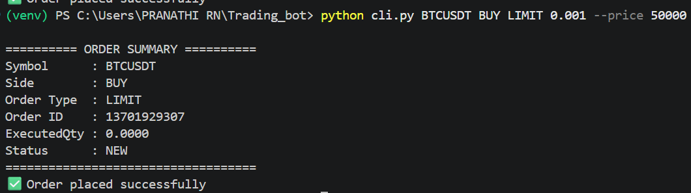
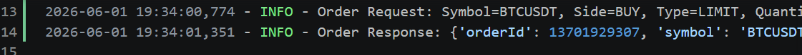

# Binance Futures Testnet Trading Bot

## Overview

This project is a Python-based trading bot that places MARKET and LIMIT orders on Binance Futures Testnet (USDT-M).

The bot supports:

- BUY orders
- SELL orders
- MARKET orders
- LIMIT orders
- CLI-based user input
- Logging
- Error handling
- Input validation

### Tested Successfully

- BUY MARKET
- SELL MARKET
- BUY LIMIT

## Project Structure

trading_bot/

├── bot/

│ ├── client.py

│ ├── orders.py

│ ├── validators.py

│ └── logging_config.py

├── logs/

│ └── trading_bot.log

├── cli.py

├── requirements.txt

└── README.md

---

## Installation

Create virtual environment:

python -m venv venv

Activate environment:

Windows:

venv\Scripts\activate

Install dependencies:

pip install -r requirements.txt

---

## Environment Variables

Create a .env file:

BINANCE_API_KEY=your_testnet_api_key

BINANCE_API_SECRET=your_testnet_secret_key

---

## Usage

### MARKET Order

python cli.py BTCUSDT BUY MARKET 0.001

### LIMIT Order

python cli.py BTCUSDT BUY LIMIT 0.001 --price 50000

---

## Logging

Logs are stored in:

logs/trading_bot.log

The log file records:

* Order requests
* Order responses
* API errors
* Unexpected exceptions

---

## Assumptions

* User has a Binance Futures Testnet account.
* API credentials are valid.
* Internet connection is available.
* Trading occurs only on Binance Futures Testnet.

---
## Sample Outputs

### MARKET Order Execution

### LIMIT Order Execution

### Log File

## Author

Pranathi
